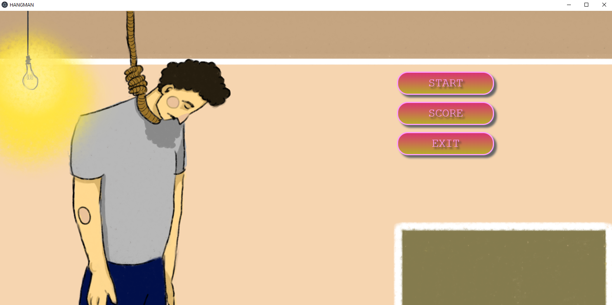
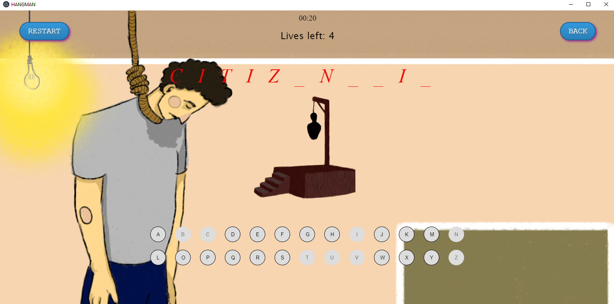
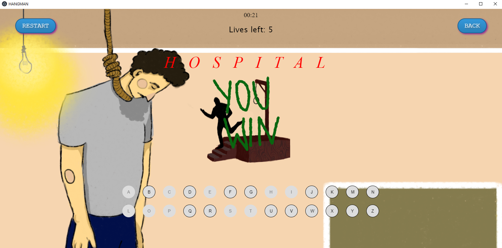
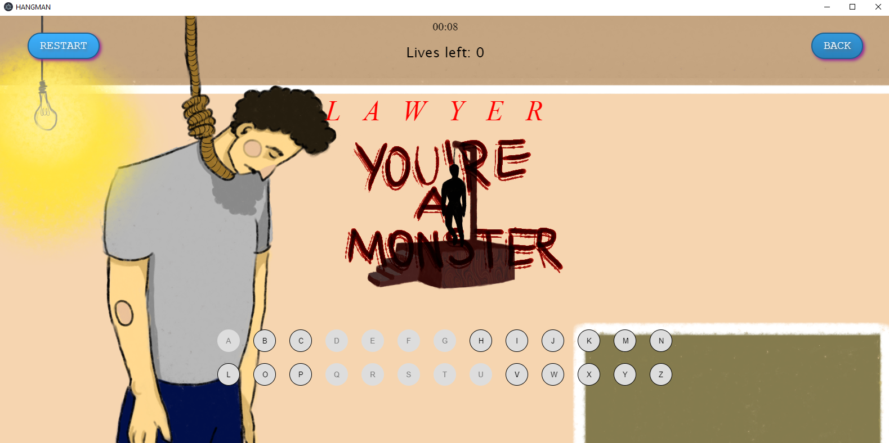
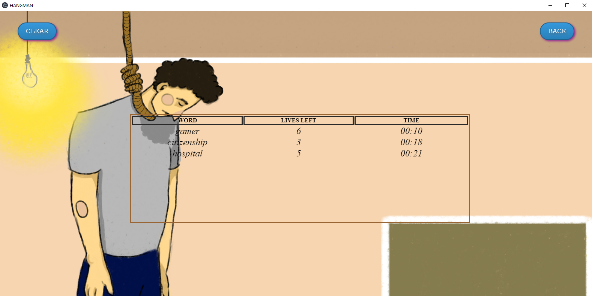

# Hangman

This project presents a simple Hangman game. Game is about guessing the correct word hidden behind the "_" marks. Player has 7 lives at the beggining. If the word does not conatin the letter picked by a player, proprer image of the hangman shows up, and lives go -1. If the game results in guessing the word, a record will be add to a file, which can be seen  in SCORE view.












Clone the repository. Open command line  in this folder and write 
````bash
npm install 
npm start
````
